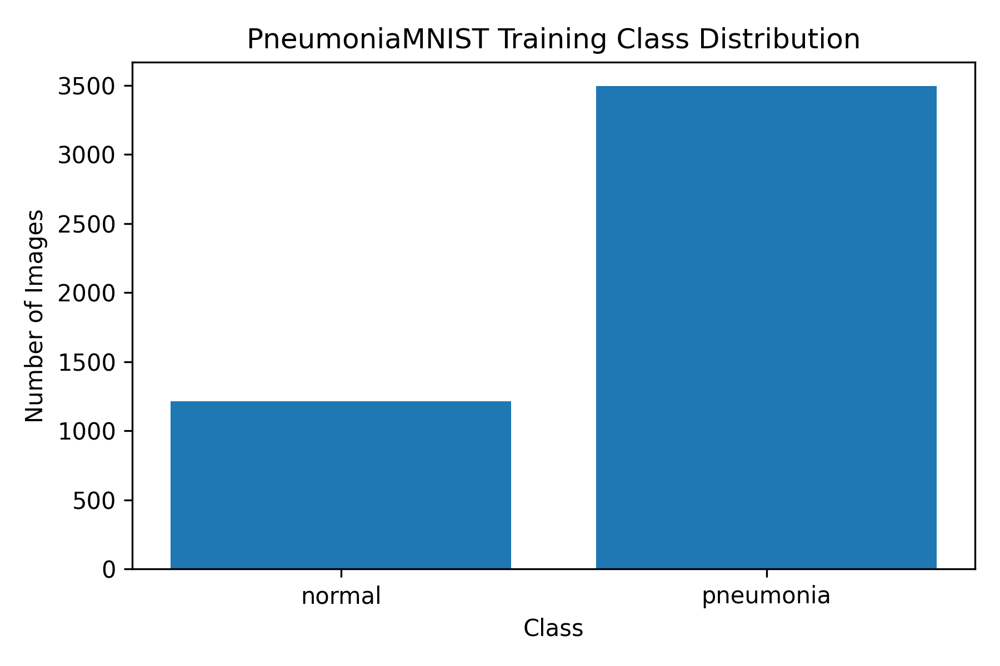
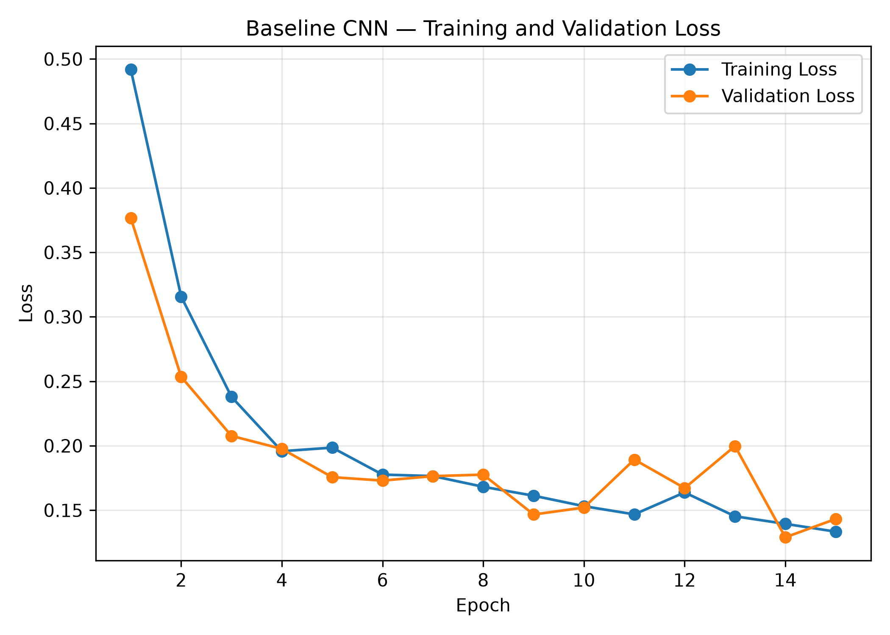
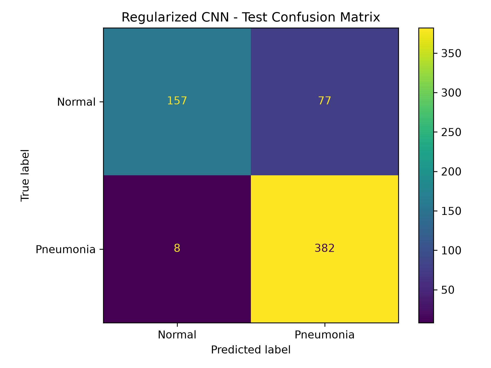
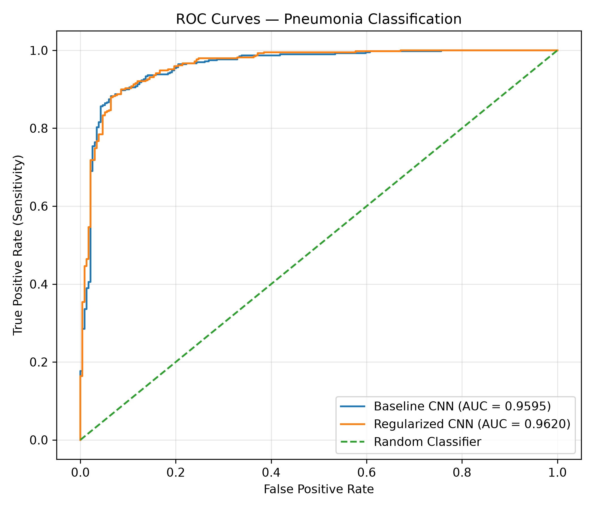
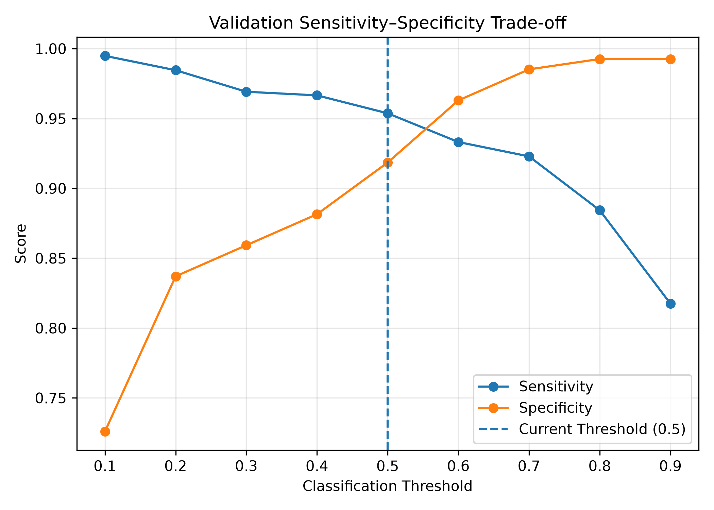
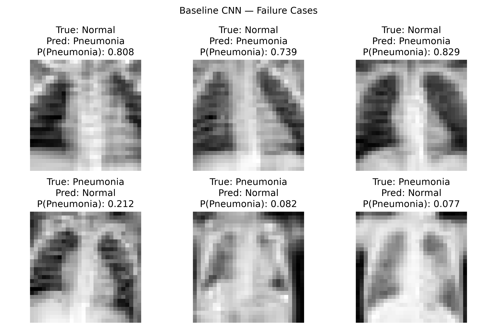

# CPU-Friendly Pneumonia Classification from Pediatric Chest X-Rays

## AI/ML Engineer Hiring Assignment Report

## Abstract

This project develops and evaluates a lightweight convolutional neural network for binary pneumonia classification using pediatric chest X-rays. The goal was not to maximize benchmark accuracy, but to construct a complete and explainable machine-learning workflow that runs reproducibly on a standard CPU. The work uses the publicly available PneumoniaMNIST dataset, retains its official train, validation, and test splits, and compares a baseline CNN with a second pipeline using conservative geometric augmentation and dropout. The baseline achieved 89.10% test accuracy, 96.67% sensitivity, 76.50% specificity, a 91.73% pneumonia F1 score, and a ROC-AUC of 95.95%. The regularized pipeline increased sensitivity to 97.95% and slightly increased ROC-AUC to 96.20%, but reduced specificity to 67.09%. The results show why medical-image classifiers must be assessed using clinically relevant error trade-offs rather than accuracy alone. The repository also contains visual failure analysis, validation-based threshold analysis, single-image inference, and a local AI assistant.

## 1. Problem definition

Pneumonia is an infection that can produce visible changes in chest radiographs. This project formulates pneumonia identification as binary image classification:

- Class 0: Normal
- Class 1: Pneumonia

The task is clinically relevant because chest radiography is commonly used during evaluation of suspected pneumonia, and an automated classifier could potentially serve as one component in a screening or prioritization workflow. Missing a positive case may delay review, whereas excessive false-positive alerts may increase workload. The relative cost of these errors depends on the intended workflow, so sensitivity and specificity must be interpreted together.

This problem was selected because it provides a meaningful medical-imaging task that remains feasible under the assignment's two-day and CPU-only constraints. PneumoniaMNIST also provides documented, standardized splits that support reproducible experimentation. The resulting system is strictly experimental: it is not intended to replace a radiologist, establish a diagnosis, or operate without clinical validation and human oversight.

## 2. Dataset

### 2.1 Source and composition

The project uses PneumoniaMNIST from MedMNIST, a publicly available collection of standardized biomedical image datasets. PneumoniaMNIST contains 5,856 pediatric chest X-rays. Images are grayscale and have been center-cropped and resized to 28 x 28 pixels by the dataset creators.

The official splits were retained:

| Split | Normal | Pneumonia | Total |
|---|---:|---:|---:|
| Training | 1,214 (25.79%) | 3,494 (74.21%) | 4,708 |
| Validation | 135 (25.76%) | 389 (74.24%) | 524 |
| Test | 234 (37.50%) | 390 (62.50%) | 624 |

The class distribution is imbalanced toward pneumonia. On the test set, an uninformative classifier predicting pneumonia for every image would obtain 62.5% accuracy while having zero specificity. Accuracy alone is therefore insufficient.

### 2.2 Dataset challenges

The 28 x 28 representation enables fast CPU experiments but discards fine radiographic detail. The pediatric population limits generalization to adults. Differences in prevalence between the official training and test splits may affect threshold-dependent metrics. Furthermore, performance on a benchmark distribution does not establish performance across hospitals, scanners, acquisition protocols, or patient populations.

## 3. Model development

### 3.1 Preprocessing

Each image is converted to a tensor and normalized using mean 0.5 and standard deviation 0.5. This approximately maps pixels from [0, 1] to [-1, 1]. Validation and test images receive no random transformations.

The second experiment applies conservative augmentation only during training:

- Random rotation up to plus or minus 7 degrees
- Horizontal and vertical translation up to 5%

Horizontal flipping was avoided because augmentation should preserve plausible radiographic geometry and laterality. The transformations were kept small to avoid producing anatomically unrealistic images.

### 3.2 Architecture

The baseline is a compact PyTorch CNN:

1. 3 x 3 convolution, 1 to 32 channels; ReLU; 2 x 2 max pooling
2. 3 x 3 convolution, 32 to 64 channels; ReLU; 2 x 2 max pooling
3. 3 x 3 convolution, 64 to 128 channels; ReLU
4. Adaptive average pooling to 1 x 1
5. Linear layer from 128 features to one output logit

The architecture was chosen because it is easy to train on a CPU, has sufficient capacity for low-resolution images, and is straightforward to explain. Adaptive average pooling reduces parameters and permits a compact classifier, although it may discard useful spatial information.

The regularized model uses the same feature extractor and adds dropout with probability 0.3 before the final linear layer. Because augmentation and dropout were introduced simultaneously, this experiment tests a combined regularized pipeline rather than isolating either component.

### 3.3 Training strategy

Both experiments use:

| Setting | Value |
|---|---|
| Device | CPU |
| Seed | 42 |
| Batch size | 64 |
| Epochs | 15 |
| Optimizer | Adam |
| Learning rate | 0.001 |
| Loss | BCEWithLogitsLoss |
| Checkpoint rule | Lowest validation loss |

`BCEWithLogitsLoss` was selected because the model produces one binary logit and the loss combines sigmoid activation with binary cross-entropy in a numerically stable calculation. A sigmoid is applied only during inference to obtain a pneumonia score. The baseline's best validation loss was 0.1290 at epoch 14, with validation accuracy of 94.47%. The regularized experiment achieved a best validation loss of 0.1255.

## 4. Evaluation

### 4.1 Metrics

The following metrics are reported:

- Accuracy: overall fraction classified correctly
- Precision: fraction of pneumonia predictions that are positive cases
- Sensitivity/recall: fraction of pneumonia cases detected
- Specificity: fraction of normal cases detected
- F1: harmonic mean of pneumonia precision and recall
- ROC-AUC: threshold-independent ranking performance
- Confusion matrix: counts of each error type

### 4.2 Test results

| Model | Accuracy | Pneumonia precision | Sensitivity | Specificity | F1 | ROC-AUC |
|---|---:|---:|---:|---:|---:|---:|
| Baseline | 0.8910 | 0.8727 | 0.9667 | 0.7650 | 0.9173 | 0.9595 |
| Regularized | 0.8638 | 0.8322 | 0.9795 | 0.6709 | 0.8999 | 0.9620 |

The baseline confusion matrix was:

| | Predicted normal | Predicted pneumonia |
|---|---:|---:|
| Actual normal | 179 | 55 |
| Actual pneumonia | 13 | 377 |

The regularized confusion matrix was:

| | Predicted normal | Predicted pneumonia |
|---|---:|---:|
| Actual normal | 157 | 77 |
| Actual pneumonia | 8 | 382 |

The baseline provides the better balance at threshold 0.5: it has higher accuracy, precision, specificity, and F1, with 22 fewer false positives. The regularized pipeline detects five additional pneumonia cases and has a slightly higher ROC-AUC, but creates 22 additional false positives. The 0.0025 ROC-AUC difference is small and was not tested for statistical significance.

The regularized model may be preferred in a screening workflow where missing a pneumonia case is considerably more costly and additional review is acceptable. Neither model is universally superior; the operating point must follow a defined use case.

### 4.3 Threshold analysis

Threshold analysis was performed using baseline validation predictions rather than selecting a threshold on the test set. Reducing the threshold increased sensitivity but decreased specificity. For example, threshold 0.2 produced validation sensitivity of 98.46% and specificity of 83.70%, whereas threshold 0.7 produced sensitivity of 92.29% and specificity of 98.52%.

The default threshold of 0.5 was retained for the reported test metrics. A real product should define acceptable sensitivity and specificity in advance, select the threshold on development data, and lock it before external testing. The sigmoid value should not be described as a clinical probability because calibration was not evaluated.

### 4.4 Failure analysis

At threshold 0.5, the baseline made 55 false-positive and 13 false-negative predictions. Examples in `results/failure_cases.png` show that some incorrect predictions are made with high confidence, not only near the decision boundary. Low resolution makes clinical interpretation difficult and may conceal subtle findings.

False negatives are particularly concerning in a screening setting because a positive case would not be flagged. False positives are also consequential: high alert volume can increase unnecessary review and contribute to alert fatigue. The appropriate trade-off cannot be decided from benchmark metrics alone.

### 4.5 Methodological caveat

Both experimental models were evaluated on the test set and their test behavior was subsequently compared when describing the preferred model. Therefore, this comparison should be considered exploratory rather than a perfectly untouched final test. A stricter experiment would define a selection metric, choose the model and threshold using validation data only, and evaluate one locked pipeline once on the test set. Repeated runs or confidence intervals would also help determine whether small differences are stable.

## 5. Improving the model

If the project were developed toward a real medical-imaging product, the highest-priority improvement would be data quality and validation rather than merely a larger network.

### 5.1 Data and validation

- Use higher-resolution radiographs so subtle structures are retained.
- Collect diverse multi-institutional data across scanners, sites, and populations.
- Separate patients across splits and examine demographic and acquisition subgroups.
- Conduct external and prospective validation before workflow use.
- Review label quality and disagreement with qualified clinicians.

These steps improve relevance and expose distribution shift, but require governance, privacy controls, clinical expertise, and substantially more time.

### 5.2 Modeling

- Evaluate lightweight pretrained architectures such as MobileNet or ResNet.
- Investigate medical-domain or self-supervised pretrained representations.
- Perform separate augmentation-only and dropout-only ablations.
- Tune learning rate, weight decay, model capacity, and augmentation magnitude systematically.
- Explore ensembles if their improvement justifies additional inference cost.

Transfer learning may improve feature quality, especially at higher resolution, but introduces more computation and dependence on the pretraining distribution. Ensembles often improve robustness but reduce interpretability and increase operational cost.

### 5.3 Decision quality

- Define clinical operating requirements before threshold selection.
- Evaluate calibration using reliability diagrams and Brier score.
- Apply temperature scaling or another validation-fitted calibration method if needed.
- Report uncertainty or abstain on unsuitable and out-of-distribution inputs.
- Monitor drift and subgroup performance after deployment.

Explainability methods could be used cautiously as debugging tools, but heat maps should not be treated as proof of correct clinical reasoning.

## 6. AI assistant

The repository includes a lightweight assistant implemented with Ollama and the local `phi3:mini` language model. Project facts and measured results are stored in `assistant/project_context.txt` and inserted into a restrictive system prompt. The prompt instructs the model to answer only from supplied information, distinguish validation from test results, avoid inventing metrics, and avoid diagnostic claims.

The assistant is available through a command-line interface and a Streamlit chat application. Keeping inference local avoids dependence on a paid API and demonstrates integration of an LLM into an ML workflow. Limitations remain: prompt grounding reduces but does not eliminate hallucination, the context is manually maintained, and no formal assistant evaluation was performed. A stronger implementation would generate context from machine-readable experiment artifacts and include automated factuality tests.

## 7. Reproducibility

The repository provides scripts for dataset inspection, both training experiments, evaluation, plots, threshold analysis, inference, and the assistant. Saved checkpoints and training histories are included. A fresh virtual environment should be created and dependencies installed from `requirements.txt`; the complete command sequence is documented in `README.md`.

Future reproducibility improvements include pinning tested dependency versions, recording Python and platform versions, saving metrics as JSON, using a shared configuration module, and running multiple seeded experiments.

## 8. Conclusion

This project demonstrates an end-to-end CPU-friendly medical-image classification workflow. The baseline CNN achieved strong pneumonia sensitivity and ROC-AUC while retaining materially better specificity than the regularized experiment. The results also demonstrate that a nominal improvement in sensitivity or ROC-AUC can come with an operationally important increase in false positives.

The model is not clinically deployable. Its low-resolution pediatric benchmark data, lack of external validation, uncalibrated scores, and exploratory model comparison limit interpretation. Nevertheless, the work provides a reproducible foundation and demonstrates appropriate attention to evaluation, failure analysis, decision thresholds, software integration, and responsible communication.

## References

1. Yang J, Shi R, Wei D, et al. MedMNIST v2: A large-scale lightweight benchmark for 2D and 3D biomedical image classification. *Scientific Data*. 2023.
2. MedMNIST project and dataset documentation: https://medmnist.com/
3. new
